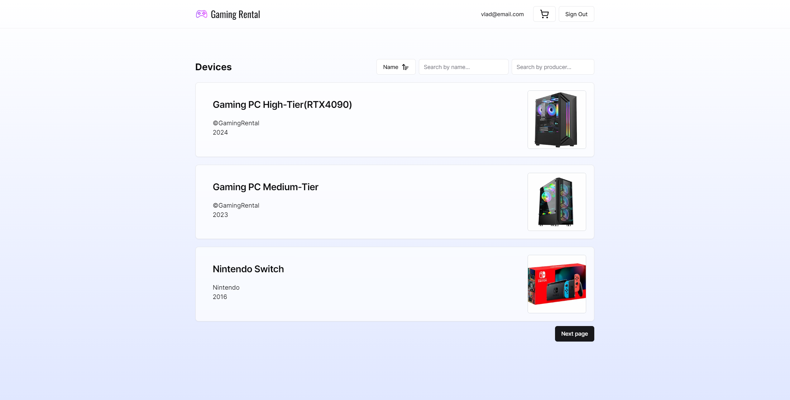
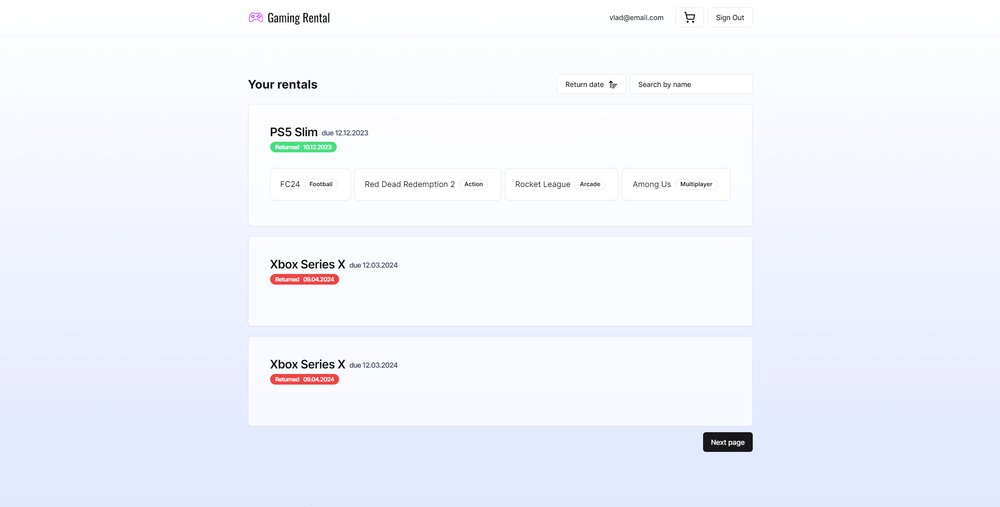
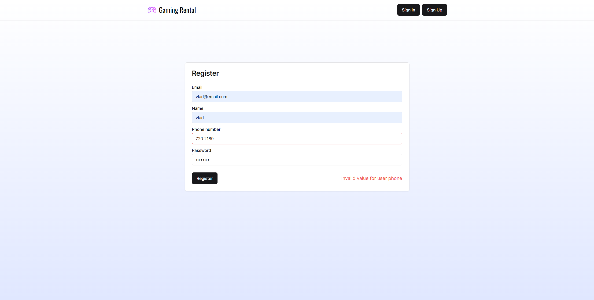

#  Gaming Rental
## Business requirements

The API is intended to be used by company workers in order to manage business operations.
**Requirements**:
1. The API will support searching for existing clients
2. The API will allow registering new client
3. The API will allow updating client information
4. The API will allow fetching a specific client
5. The API will ensure the management of rental operations
6. The API will enable searching for devices
7. The API will allow accessing specific device information
8. The API will enable registering new devices
9. The API will allow device removal, along with all associated units
10. The API will allow verifying unit availability, based on device
11. The API will support searching for game copies

**MVP**:
1. The API client search functionality will either return the entire list of clients, or a filtered one. The list may be filtered by the client name, thus only returning the specific client, or by name, where an entire list with corresponding names will be provided
2. Only valid clients may be registered. Provided email and phone number must be valid. The email must be unique across all users.
3. The API will ensure that new rentals are registered only if the associated device unit/games are available. Upon rental register, all included products are marked as unavailable.
4. The API will ensure that all invalid requests, with incorrect/missing data, be rejected and provide an explanatory message.
5. The API will ensure that actions with values that do not match with what is required will be cancelled. Values that are too short or are out of the required range will lead to rejecting the request.

## Frontend

- **Next.js** was used to build the frontend. The frontend is a simple web application that allows the user to interact with the API.
- Users can register, login, and perform CRUD operations on clients, devices, and rentals.
- They can view all available devices, create rentals and return rentals. The devices and rentals are paginated and can be filtered/sorted. 

|                     |                         |                         |
|---------------------|-------------------------|-------------------------|
|  |  |  |

## API

### /api/clients/update/{id}

#### PUT
##### Summary:

Update client info

##### Parameters

| Name | Located in | Description   | Required | Schema |
|------|------------|---------------|----------|--------|
| id   | path       | The client ID | Yes      | long   |

##### Responses

| Code | Description                      |
|------|----------------------------------|
| 200  | Client found                     |
| 404  | Client not found                 |
| 409  | Email or phone is already in use |

##### Security

| Security Schema |
|-----------------|
| bearerAuth      |

### /api/rentals/create

#### POST
##### Summary:

Register a new rental

##### Responses

| Code | Description                                                      |
|------|------------------------------------------------------------------|
| 200  | Rental was registered successfully                               |
| 400  | Device unit not available or game copies not found/not available |
| 404  | Device unit not found                                            |

##### Security

| Security Schema |
|-----------------|
| bearerAuth      |

### /api/devices/create

#### POST
##### Summary:

Register a new device

##### Responses

| Code | Description                              |
|------|------------------------------------------|
| 200  | Device was registered                    |
| 409  | Device with the same name already exists |

##### Security

| Security Schema |
|-----------------|
| bearerAuth      |

### /api/clients/create

#### POST
##### Summary:

Add a new client

##### Responses

| Code | Description                      |
|------|----------------------------------|
| 201  | Client added                     |
| 409  | Email or phone is already in use |

##### Security

| Security Schema |
|-----------------|
| bearerAuth      |

### /api/auth/register/client

#### POST
##### Summary:

Register client user

##### Responses

| Code | Description                          |
|------|--------------------------------------|
| 200  | Client registered                    |
| 409  | Email or phone is already in use     |
| 500  | (Internal) Client role doesn't exist |

### /api/auth/login

#### POST
##### Summary:

Login user

##### Responses

| Code | Description    |
|------|----------------|
| 200  | User logged in |
| 404  | User not found |

### /api/auth/admin/login

#### POST
##### Summary:

Login admin

##### Responses

| Code | Description     |
|------|-----------------|
| 200  | Admin logged in |
| 404  | Admin not found |

### /api/rentals/return/{id}

#### PATCH
##### Summary:

Register rental return

##### Parameters

| Name | Located in | Description | Required | Schema |
|------|------------|-------------|----------|--------|
| id   | path       | Rental ID   | Yes      | long   |

##### Responses

| Code | Description                      |
|------|----------------------------------|
| 200  | Rental was returned successfully |
| 400  | Rental has been already returned |
| 404  | Rental was not found             |

##### Security

| Security Schema |
|-----------------|
| bearerAuth      |

### /api/units/of

#### GET
##### Summary:

Get device units by the device and filter by availability

##### Parameters

| Name          | Located in | Description          | Required | Schema  |
|---------------|------------|----------------------|----------|---------|
| name          | query      | Device name          | Yes      | string  |
| availableOnly | query      | Only available units | No       | boolean |

##### Responses

| Code | Description           |
|------|-----------------------|
| 200  | Device units returned |
| 404  | Device not found      |

### /api/units/of-id/{id}

#### GET
##### Summary:

Get device units by the device ID

##### Parameters

| Name | Located in | Description | Required | Schema |
|------|------------|-------------|----------|--------|
| id   | path       | Device ID   | Yes      | long   |

##### Responses

| Code | Description           |
|------|-----------------------|
| 200  | Device units returned |
| 404  | Device not found      |

### /api/rentals

#### GET
##### Summary:

Get filtered rentals

##### Parameters

| Name       | Located in | Description                    | Required | Schema  |
|------------|------------|--------------------------------|----------|---------|
| deviceName | query      | Device Name                    | No       | string  |
| returned   | query      | Rental is returned             | No       | boolean |
| pastDue    | query      | Only rentals that are past due | No       | boolean |
| page       | query      | Page number                    | No       | integer |
| sort       | query      | Sort by return date            | No       | string  |

##### Responses

| Code | Description                     |
|------|---------------------------------|
| 200  | Valid filters and rentals found |
| 404  | Client or device not found      |

##### Security

| Security Schema |
|-----------------|
| bearerAuth      |

### /api/games

#### GET
##### Summary:

Get filtered game copies

##### Parameters

| Name          | Located in | Description                 | Required | Schema  |
|---------------|------------|-----------------------------|----------|---------|
| gameId        | query      | Filter by game ID           | No       | long    |
| deviceId      | query      | Filter by device ID         | No       | long    |
| onlyAvailable | query      | Fetch only available copies | No       | boolean |

##### Responses

| Code | Description              |
|------|--------------------------|
| 200  | List of game copies      |
| 404  | Game or device not found |

### /api/devices

#### GET
##### Summary:

Get filtered devices

##### Parameters

| Name        | Located in | Description             | Required | Schema  |
|-------------|------------|-------------------------|----------|---------|
| name        | query      | Name of device          | No       | string  |
| producer    | query      | Producer name           | No       | string  |
| year        | query      | Released after the year | No       | integer |
| ifAvailable | query      | Only available          | No       | boolean |
| page        | query      | Page number             | No       | integer |
| sort        | query      | Sort devices by name    | No       | string  |

##### Responses

| Code | Description   |
|------|---------------|
| 200  | Valid filters |

### /api/devices/{id}

#### GET
##### Summary:

Get device by ID

##### Parameters

| Name | Located in | Description | Required | Schema |
|------|------------|-------------|----------|--------|
| id   | path       | Device ID   | Yes      | long   |

##### Responses

| Code | Description      |
|------|------------------|
| 200  | Device found     |
| 404  | Device not found |

### /api/devices/all

#### GET
##### Responses

| Code | Description |
|------|-------------|
| 200  | OK          |

### /api/clients

#### GET
##### Summary:

Filter clients

##### Parameters

| Name  | Located in | Description                         | Required | Schema  |
|-------|------------|-------------------------------------|----------|---------|
| email | query      | Filtered by full email              | No       | string  |
| name  | query      | Filtered by name (may be contained) | No       | string  |
| page  | query      | List page number                    | No       | integer |
| sort  | query      | Sort clients by name                | No       | string  |

##### Responses

| Code | Description                     |
|------|---------------------------------|
| 200  | Valid filters and clients found |
| 400  | Invalid filters                 |

##### Security

| Security Schema |
|-----------------|
| bearerAuth      |

### /api/clients/{id}

#### GET
##### Summary:

Get a client by ID

##### Parameters

| Name | Located in | Description   | Required | Schema |
|------|------------|---------------|----------|--------|
| id   | path       | The client ID | Yes      | long   |

##### Responses

| Code | Description      |
|------|------------------|
| 200  | Client found     |
| 404  | Client not found |

##### Security

| Security Schema |
|-----------------|
| bearerAuth      |

### /api/devices/remove/{id}

#### DELETE
##### Summary:

Remove a device

##### Parameters

| Name | Located in | Description | Required | Schema |
|------|------------|-------------|----------|--------|
| id   | path       | Device ID   | Yes      | long   |

##### Responses

| Code | Description        |
|------|--------------------|
| 204  | Device was removed |
| 404  | Device not found   |

##### Security

| Security Schema |
|-----------------|
| bearerAuth      |

### /api/clients/remove/{id}

#### DELETE
##### Summary:

Remove a client

##### Parameters

| Name | Located in | Description   | Required | Schema |
|------|------------|---------------|----------|--------|
| id   | path       | The client ID | Yes      | long   |

##### Responses

| Code | Description      |
|------|------------------|
| 204  | Client removed   |
| 404  | Client not found |

##### Security

| Security Schema |
|-----------------|
| bearerAuth      |
